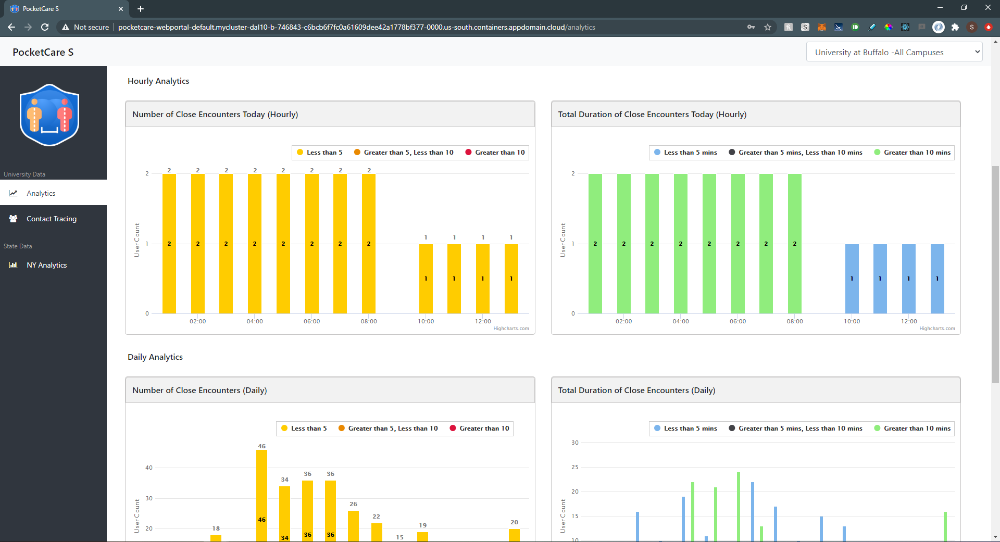
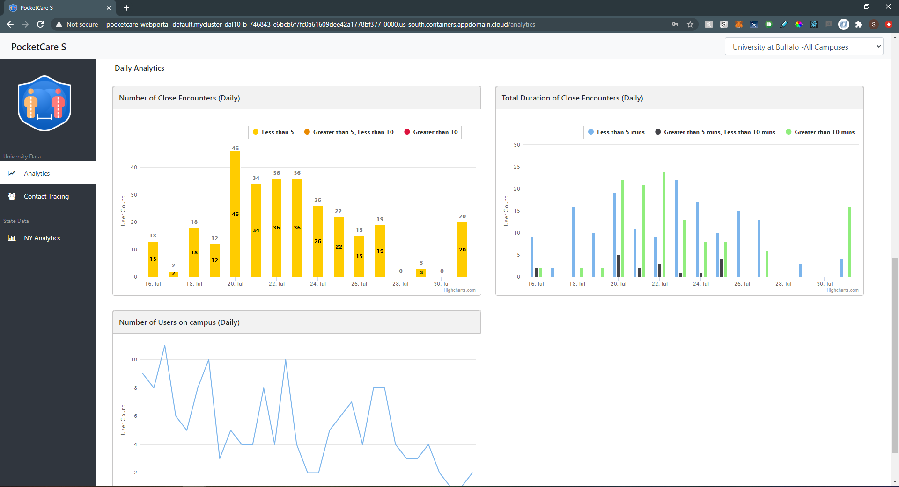
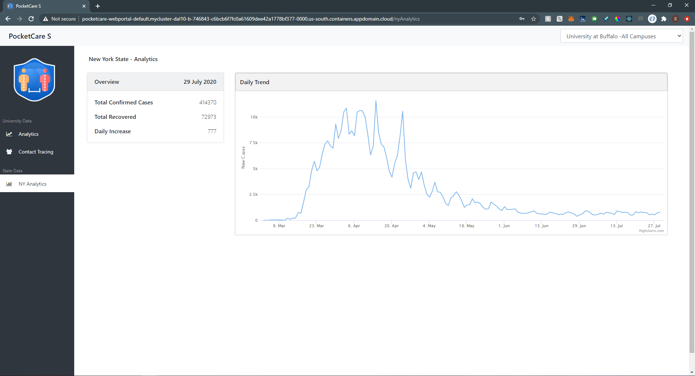
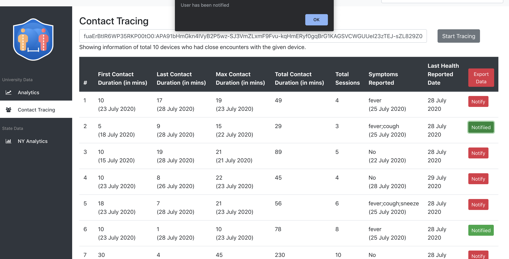

# PocketCare S - WebPortal (FrontEnd)


**Call for code submission for COVID-19 track.**

PocketCare S is a comprehensive smartphone-based solution for monitoring close encounters. It is a bluetooth low energy (BLE) based solution which enables smartphones to send and receive anonymous beacon signals. It checks the distance between a smartphone and another beacon (or smartphone running PocketCare S) to see if they are close to each other (less than 2m). If so, the smartphone records the duration of such a close encounter with another beacon. 

PocketCare S is designed to report social distance information without collecting or revealing any personally identifiable information about any specific individual.


## Contents 
1. [Demo Video](#demo-video) 
2. [The Architecture](#the-architecture)
3. [Getting Started](#getting-started)
4. [How does PocketCare S Work?](#how-does-pocketcare-s-work)
5. [Built With](#built-with)
6. [Project RoadMap](#project-roadmap)
7. [Further Readings](#further-readings)
8. [License](#license)
9. [Acknowledgments](#acknowledgements)

## Demo Video 

[](http://www.youtube.com/watch?v=JnOWwagUgxQ "PocketCare S Demo")
 
 
## The Architecture


## Getting Started  

### Prerequisites for installation on local machine

Before you begin, make sure you satisfy the following requirements in order to run the server on your local system:

1. NPM (node package manager) which can be installed from [here](https://nodejs.org/en/download/)
   
### Running the application on local system
1. Clone the repository
2. Open the project on Visual Studio Code
3. Search for file constants.js
4. Update the Server API URL from [here]() and paste inplace of "YOUR_HOSTED_SERVER_API_URL"
   export const baseUrl =
  "YOUR_HOSTED_SERVER_API_URL";
5. Inside the project directory open the terminal and run the following commands in order:
     
     ```npm install```
    
     ```npm start```

### Steps for Openshift Deployment
1. Install the OC cli on your system using the following [link](https://docs.openshift.com/container-platform/4.2/cli_reference/openshift_cli/getting-started-cli.html)
2. Once installed, open the Openshift console
3. Copy the Login command as shown in the figure below 
4. Copy and paste the login command in terminal at the folder where the react application source code resides.
5. Inside the terminal run the following commands in order:
     
     ```npm install```
    
     ```npx nodeshift --strictSSL=false --dockerImage=nodeshift/ubi8-s2i-web-app --imageTag=10.x --build.env YARN\_ENABLED=true --expose```
6. This will install the react application on Openshift and public url will be provided in terminal logs.

### Web Portal - Screenshots

1. Single Sign On   Note: This step is removed for the current submission as University Single Sign On cannot be provided for verification.

2. University Selection  
3. User Login  
4. Analytics DashBoard  



5. New York Analytics  
6. Contact Tracing  

#### Steps to perform Contact Tracing.
1. Get the patient's App-Client ID following the steps as mentioned [here](https://github.com/PocketCareS/PocketCareS-Android#getting-app-client-id)
2. Copy and paste the ID in the text box with the label "Enter COVID-19 infected patient's App-Client ID for tracing".
3. On Start tracing the web portal will fetch all the APP-Client ID which have come in contact with the infected user within 14 days and had atleast 5 minutes of close encounter.
4. The close encountered App-Client ID with their respective encouter details will be displayed as shown in **Contact Tracing Screenshot**
5. The information displayed is the brief information based on which tracer can make decision to notify the respective User.
6. On **Notify** push notification will be sent using IBM's Push notification service with the proper guidelines.
7. Tracer can also export the detailed information of the encountered user by clicking on the **Export Data** in top right corner of table. 


## How does PocketCare S Work?

### Key Highlights (Mobile Application)

1. Close encounter data will be displayed in the mobile application after a close encounter session starts. A close encounter session starts when two people are within **2 meters** for at least **5 minutes**. 
2. The **virtual bluetooth name** changes every hour to ensure **user privacy**. 
3. Data upload to the server takes place every hour.
4. Data is stored in user's phone for a maximum of 14 days. 

### Detailed Architecture 


### Security and Privacy 


**For a more detailed description, refer to the [additional information](#additional-information) section.**


## Built With 

In this submission, we have used IBM’s Cloud **Red Hat OpenShift** to deploy our server (using **OpenJDK 8**), database (using **MongoDB**), the web portal (using **Node JS Server**) and **IBM Push Notification Service** from **IBM Cloud** in the Android application of PocketCare S as a proof of concept. In the future, we will be integrating other IBM services into the PocketCare S solution.

## Project Road Map 


## Additional Information 

You can read more about PocketCare S on our [website](https://engineering.buffalo.edu/computer-science-engineering/pocketcares.html). We also have a [White Paper](https://docs.google.com/document/d/e/2PACX-1vT6UqA3HByzG5Di576gmz-JWzgKOFx5KLYGgJMpxcmWkOXYJ_vUFz2h1w2LnDNWI4y-xnyKhPi_s70p/pub) which can be accessed here.  

PocketCare S is also available on [Google Play](https://play.google.com/store/apps/details?id=com.ub.pocketcares) and to the University at Buffalo (UB) community using the [Apple Developer Enterprise Program](https://engineering.buffalo.edu/computer-science-engineering/pocketcares/pocketcares-ios.html).

## License 

This project is licensed under the Apache 2 License - see the [LICENSE](LICENSE) file for details.

## Acknowledgements

Special thanks to all who helped bring the project to fruition:

Sourav Samanta, Rishabh Joshi, Jeetendra Gan, Shanelle Ileto, Aritra Paul, Dr. Peter Winkelstein, Dr. Matthew R. Bonner, Kevin Wang, Chen Yuan, Dheeraj Bhatia, Latheeshwarraj Mohanraj, Dr. Wen Dong, Dr. Tong Guan, Dr. Marina Blanton, Sasha Shapiro, Stephen Fung

And our deepest gratitude for the support of **University at Buffalo**.
